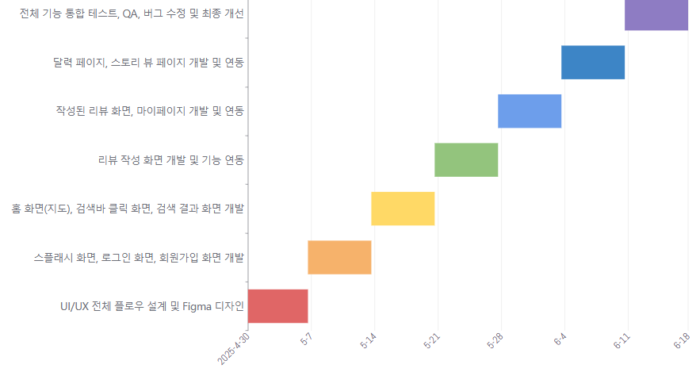

# 지도 기반 맛집 리뷰 블로그 앱

## 📝 프로젝트 소개
ReviewEat은 지도 기반 탐색, 개인 리뷰 작성, 달력형 일기장 기능을 결합한 맛집 리뷰 & 관리 앱입니다.
기존 지도앱, 블로그, 메모장 등이 가진 한계를 보완하여 사용자가 개인화된 맛집 탐색과 프라이빗 리뷰 작성을 효율적으로 할 수 있도록 지원합니다.

카카오맵 API를 활용한 정확한 위치 정보와 Flutter를 이용한 크로스 플랫폼 지원을 특징으로 합니다.

## 🎯 배경 및 목적
기존의 지도앱, 블로그, 메모장에는 다음과 같은 한계가 존재.

| 기존 도구 | 한계                                    |
| ----- | ------------------------------------- |
| 지도앱   | 상세 리뷰 작성 제한, 방문 이력 관리 불편, 세부 검색 기능 부족 |
| 블로그   | 지도 기반 탐색 부재, 검색 기능 비효율                |
| 메모장   | 사진·위치·태그 통합 불가, 체계적 관리 어려움            |


ReviewEat은 이런 한계를 보완해
맛집 관리와 개인 경험 기록을 더 효율적이고 프라이빗하게 지원.

## 🚀 주요 기능
**지도 기반 음식점 탐색**
- 카카오맵 API 활용 실시간 음식점 검색
- 지도 상 마커로 위치 표시
- 카테고리, 동반여부, 거리, 평점 기반 필터링 지원
- 방문 상태에 따른 마커 표시  
  ✔ 방문: 검은색 + 원형  
  ⚪ 미방문: 회색 + 원형  
  ⭐ 즐겨찾기: 노란색 + 별  

**리뷰 달력**
- 날짜별 리뷰 저장 및 썸네일 표시
- 날짜 클릭 시 인스타 스타일 스토리 뷰로 전환

**스토리 뷰**
- 사진 중심 전체 화면 리뷰
- 장소·내용·별점·태그 정보 표시
- 여러 장 사진 슬라이드 지원

**리뷰 작성**
- 위치 검색 지원
- 사진 업로드, 리뷰 작성, 평점 부여, 동반상태 추가
- 공개 범위 선택  
  🔒 나만 보기  
  🔗 비공개 링크 공유 (개별 URL 발급)

**프라이빗 리뷰 공유**
- 링크 기반 안전한 리뷰 공유
- 링크 수신자만 열람 가능 (그룹·친구 기능은 일단 없음)

**마이페이지**
- 내가 쓴 리뷰 모아보기
- 알림 등 개인 설정 지원

## 🔧 기술 스택
| 구성 요소     | 기술             | 설명                                    |
|------------|----------------|---------------------------------------|
| Frontend   | Flutter         | 모바일 앱 개발 (iOS, Android 동시 지원)   |
| Map API     | KakaoMap API    | 음식점 검색 및 지도 렌더링                   |
| Backend    | FastAPI         | Python 기반 고성능 API 서버                 |
| DB   | PostgreSQL      | 사용자, 리뷰, 음식점 데이터 저장              |
| Deployment | Docker Compose  | 백엔드, DB 컨테이너화하여 통합 관리            |

## 📅 개발 일정 (간트 차트)



## 📢 기여 방법
ReviewEat 프로젝트에 관심 가져주셔서 감사합니다.  
기여는 언제든 환영합니다.

1. 본 리포지토리를 Fork 합니다.
2. 새로운 브랜치를 생성합니다.
    ```bash
    git checkout -b feature/원하는기능이름
    ```
3. 원하는 기능을 추가하거나 버그를 수정합니다.
4. 변경 사항을 커밋합니다.
    ```bash
    git commit -m "설명에 맞는 커밋 메시지"
    ```
5. 원격 브랜치로 푸시합니다.
    ```bash
    git push origin feature/원하는기능이름
    ```
6. 본 리포지토리에 Pull Request를 생성합니다.

## 📝 라이선스
MIT License
